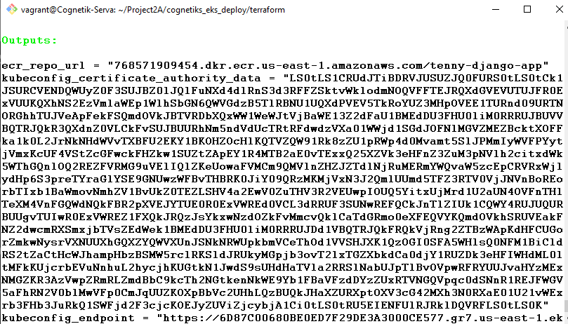

# Task 2- Django Application Deployment with EKS,ECR and S3

# Django on AWS with Terraform & EKS

This project demonstrates the deployment of a Django application on AWS EKS (Elastic Kubernetes Service) with a complete cloud infrastructure including RDS PostgreSQL, S3 for static files.

---
# Project Overview

### AWS Infrastructure


# Step-by-Step Deployment Process

## 1. Design project structure and write manifests

For this project I automated infrastructure provisioning using **Terraform**.  

The deployed resources include:

- **VPC, Subnets, Internet Gateway, NAT Gateway**
- **EC2 instances (Ubuntu Jammy) running Django via Gunicorn**
- **RDS PostgreSQL database**
- **S3 bucket for static/media files**
- **Elastic Load Balancer (ELB) for high availability**
- **CloudWatch for logging and monitoring**
- **ECR for Docker image repository**
- **Horizontal Pod Autoscaler for Scaling pods**
---

## 2. Prerequisites

Provision VPC, EKS, RDS, S3, ECR

Terraform outputs:

- AWS CLI installed and configured with IAM user credentials  
- Terraform installed  
- Git installed
- Docker installed 
- Kubectl installed 
- Helm installed 
- A valid AWS Key Pair for EC2 access

---

## 3. Run Terraform

- ecr_repo_url
- rds_endpoint
- rds_port
- rds_username
- rds_password
- rds_db_name
- s3_bucket_name
- s3_bucket_region


## 4. Configure kubectl and apply auth

```bash

# Configure kubectl to access your EKS cluster
aws eks update-kubeconfig --region us-east-1 --name tenny-eks

# Confirm our cluster is the current context
kubectl config current-context

# Verify cluster connection
kubectl cluster-info


```


# Associate cluster admin policy to $USER

```bash

aws eks associate-access-policy \
    --cluster-name $CLUSTER_NAME \
    --principal-arn "arn:aws:iam::${ACCOUNT_ID}:user/$USER" \
    --policy-arn "arn:aws:eks::aws:cluster-access-policy/AmazonEKSClusterAdminPolicy" \
    --access-scope type=cluster
```

## Verify RBAC access

Test your access:

```python
kubectl auth can-i create deployment --all-namespaces
kubectl auth can-i create service --all-namespaces
kubectl auth can-i get nodes
```

You should see "yes" for all these commands


## 5. Build & Push Image to ECR

Get ECR Login Credentials to login to ECR:

```python
aws ecr get-login-password --region us-east-1 | docker login --username AWS --password-stdin 76xxxxxxxxxx4.dkr.ecr.us-east-1.amazonaws.com
```

Set up image pull credentials for ECR:

```python
kubectl create secret docker-registry ecr-credentials \
  --namespace django-app \
  --docker-server=76xxxxxxxxxx4.dkr.ecr.us-east-1.amazonaws.com \
  --docker-username=AWS \
  --docker-password=$(aws ecr get-login-password --region us-east-1)
```

Then Build the app image , tag it and push to ECR:

```python
docker build -t tenny-django-app .
docker tag tenny-django-app:latest 76xxxxxxxxxx4.dkr.ecr.us-east-1.amazonaws.com/tenny-django-app:latest
docker push 76xxxxxxxxxx4.dkr.ecr.us-east-1.amazonaws.com/tenny-django-app:latest
```

## 6. Deploy The Application to the Cluster

Create namespace:

```python
kubectl create namespace django-app
```

Create and Apply secret for sensitive environment variables:


```python
kubectl create secret generic django-secrets --namespace django-app --from-literal=DJANGO_SECRET_KEY="mysecrxxxxxx" --from-literal=RDS_DB_NAME="tennydb" --from-literal=RDS_USERNAME="tenny" --from-literal=RDS_PASSWORD="TennySecureDBpassxxx" --from-literal=RDS_HOSTNAME="terraform-20250910091155198700000011.c29e6mc0mace.us-east-1.rds.amazonaws.com" --from-literal=RDS_PORT="5432" --from-literal=DJANGO_SUPERUSER_USERNAME="tenny100" --from-literal=DJANGO_SUPERUSER_EMAIL="exampla@gmail.com" --from-literal=DJANGO_SUPERUSER_PASSWORD="supersecure123" --from-literal=AWS_STORAGE_BUCKET_NAME="tenny-eks-django-static" --from-literal=AWS_REGION="us-east-1"
```

(Make sure you update your values.yaml to use secrets)


## 7. Deploy with Helm

```python
cd helm/
helm --install tenny-django-app . --namespace django-app
```

## 8. Verify Deployment

:

```python
# Check pods
kubectl get pods -n django-app

# Check services
kubectl get svc -n django-app

# Check logs
kubectl logs -f deployment/django-app -n django-app

# Get LoadBalancer URL
ELB_URL=$(kubectl get svc django-app-service -n django-app -o jsonpath='{.status.loadBalancer.ingress[0].hostname}')
```

---

## 9. Common Issues and Troubleshooting Guide


Database Connection Issues:

```python
# Test database connectivity
kubectl run -it --rm db-test --image=postgres:15 --restart=Never --namespace django-app -- bash
psql "host=RDS_ENDPOINT port=5432 user=USERNAME dbname=DBNAME password=PASSWORD"

# Check RDS security group rules
aws ec2 describe-security-groups --group-ids $RDS_SG --query "SecurityGroups[0].IpPermissions"
```


S3 Permission Issues:

```python
# Test S3 access
kubectl run s3-test --image=amazon/aws-cli --restart=Never --namespace django-app --command -- aws s3 ls s3://BUCKET_NAME

# Add S3 permissions to node role
aws iam attach-role-policy --role-name NODE_ROLE --policy-arn arn:aws:iam::aws:policy/AmazonS3FullAccess
```

Image Pull Issues:

```python
# Create ECR pull secret
kubectl create secret docker-registry ecr-credentials \
  --namespace NAMESPACE \
  --docker-server=ACCOUNT.dkr.ecr.REGION.amazonaws.com \
  --docker-username=AWS \
  --docker-password=$(aws ecr get-login-password --region REGION)
```

Pod CrashLoopBackOff:

```python
# Check logs
kubectl logs POD_NAME -n NAMESPACE --previous

# Describe pod for events
kubectl describe pod POD_NAME -n NAMESPACE

# Check resource limits
kubectl top pods -n NAMESPACE
```

## 10. K8s Best Practices

- Use Kubernetes Secrets for sensitive data

- Implement IAM roles for service accounts (IRSA)

- Enable database encryption

- Use private subnets for RDS

- Implement CloudWatch logging

- Set up Prometheus and Grafana

- Configure alerting

- Enable RDS automated backups

---

## 12. Screenshots

---

-   
-   
-   
-   
-   
-   
-   
-   
-   
-   
-   
-   
-   
-   
-   
-   
-   
-   
-  

---

 ## 13. Destroy Infrastructure

When finished, clean up resources:

```bash
terraform destroy -auto-approve
```
